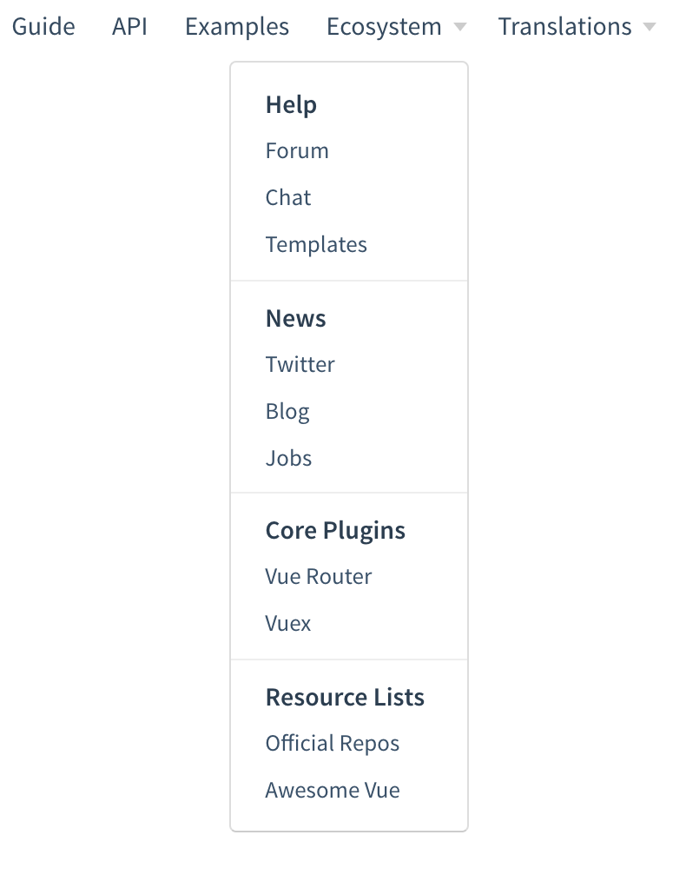

# docute

Writing docs without build process.

## How does it work

docute is a `.js` file along with its theme assets, which you can add to a static `.html` file hosted anywhere.

### All client-side

No extra setup for docute is needed, no build process, everything is performed on the fly! We're using a fork of [marked](https://github.com/chjj/marked) the gorgeous and blazing-fast markdown parser.

## Installation

Use `docute-cli` to initialize the docs folder.

Using npm:

```bash
npm i -g docute-cli
```

Using Yarn:

```bash
yarn global add docute-cli
```

<p class="tip">
  You don't really need <code>docute-cli</code>, it's just a tool for scaffolding out a doc folder and bringing you a dev-server with live reloading support. You can use any similar tool, for example, <a href="https://github.com/tapio/live-server" target="_blank">live-server</a> + <a href="http://yeoman.io/" target="_blank">yeoman generator</a>, or simply crafted by hand if you like, there's not much work you have to do!
</p>

## Quick Start

Assume that the folder you want for docs is `./docs`:

```bash
docute init ./docs
```

Now the `./docs` folder is ready, so far we got:

- README.md: Used as content of homepage
- index.html: The html that contains the scripts and styles you need
- .nojekyll: Indicates that this is not a jekyll website, ignore this if you're not deploying to github pages

Then you can preview the docs locally:

```bash
docute ./docs
```

Open http://localhost:8080 and you'll see it in action.

### Manually

Do you hate node.js or npm? Or just being too lazy to install them? You know you don't need to install `docute-cli` at all!

What we really need is an `index.html`:

```html
<!DOCTYPE html>
<html>
<head>
  <meta charset="utf-8" />
  <meta http-equiv="X-UA-Compatible" content="IE=edge">
  <meta name="viewport" content="width=device-width, initial-scale=1, maximum-scale=1, user-scalable=0" />
  <title>My Awesome Doc</title>
  <!-- the docute client styles -->
  <link rel="stylesheet" href="https://unpkg.com/docute/dist/docute.css">
</head>
<body>
  <div id="app"></div>
  <!-- load the docute client library -->
  <script src="https://unpkg.com/docute/dist/docute.js"></script>
  <!-- bootstrap your docute app! -->
  <script>
    docute.init()
  </script>
</body>
</html>
```

And that's it!

## Configuration

`docute.init` accepts an argument for setting configurations:

```js
docute.init({
  // ...config goes here
})
```

### Home Page

`README.md` in your docs folder will be treated as homepage for your website, but sometimes you may need to serve another file as your homepage. For example you're deploying `./docs` as `github pages` but already have `README.md` in your repo, why do you have to populate another file at `./docs/README.md`, right? Then just tell it which file we should use:

```js
docute.init({
  // use a markdown file from url directly
  home: 'https://raw.githubusercontent.com/egoist/docute/master/README.md'
})
```

### Landing Page

You can set the `landing` option to `true` or a custom path:

```js
docute.init({
  // true means using `landing.html`
  landing: true,
  // or custom path
  landing: '_my-landing.html',
  // or even markdown file
  landing: 'landing.md'
})
```

If you enable landing page, the route `/` will match landing page, and `/home` will be the homepage of docs.

<p class="warning">
  You cannot use <code>script</code> tag in pages, since dynamically added scripts will not be evaluated by your browser.
</p>

### History Mode

You can set `routerMode` to `'history'` enable history mode.

```js
docute.init({
  routerMode: 'history'
})
```

<p class="tip">When deployed on GitHub pages, you can add `404.html` to catch all requests.</p>

### Pages

You can also add more markdown files to display more pages. For example, adding `chinese.md` to your doc folder so that you got a new page at `/#/chinese`!

It supports directory too, just try adding a new file at `language/chinese.md`, then you'll get `/#/language/chinese`.

Note: file like `about/README.md` will be mapping to `/#/about/`, while the `/#/about` is for `about.md`.

### Sidebar

To disable the sidebar globally, set it to `false` in `config.js`:

```js
docute.init({
  sidebar: false
})
```

Or disable it for specific page:

```markdown
---
sidebar: false
---
disable sidebar for this page.
```

There will be a toggle button for switching sidebar on and off, to hide this button:

```js
docute.init({
  disableSidebarToggle: true
})
```

#### TOC

The TOC is coming from your markdown files, we parse markdown content and get headings (h2 to h5+) to group a nested TOC.

In sidebar we will show h2 to h4 headings by default, h5+ only will be visible when the main content scrolls there, you can update this by:

```js
docute.init({
  // to show h2 to h3 only
  tocVisibleDepth: 3
})
```

To disable TOC entirely, set `toc` to `false`.

### Navbar

You may need a navbar as the entrance for the pages:

```js
docute.init({
  nav: [
    // homepage
    {title: 'Home', path: '/'},
    // chinese doc
    {title: 'Chinese', path: '/language/chinese'}
  ]
})
```

<p class="tip">
  The `path` could also be an external URL, it will work exactly like a normal hyperlink.<br><br>
  Besides this, as you've learned in <span jump-to-id="pages">Pages</span> section, something like <code>/language/chinese</code> will fetch `/language/chinese.md`, if you want to fetch an external file just set the <code>source</code> option like `source: 'https://foo.com/bar.md'`
</p>

#### Custom source

A path like `/language/chinese` will make docute fetch `/language/chinese.md`, you can use `source` option to fetch another file:

```js
docute.init({
  title: 'Chinese',
  path: '/language/chinese',
  source: '/language/chinese-foo.md'
  // or even external file
  source: 'https://raw.githubusercontent.com/user/repo/master/file.md'
})
```

<p class="tip">
  You may wonder why there's `$config.home` option when we already have `source` option, that's because `source` option is only available for nav item, while `$config.home` is always available no matter if you add `/` to nav.
</p>

#### Icons

##### Icon short-hand

```js
docute.init({
  // slug for your github repo
  repo: 'tj/co',
  // twitter username
  twitter: 'realDonaldTrump',
  // the link to source file of current page
  'edit-link': 'https://github.com/egoist/docute/blob/master/docs'
})
```

To fully customize the `label`, `link` or use custom svg icons, see below.

##### Custom Icons

The built-in svg icons: `github` `twitter` `edit` `menu` `link` `search` `close`, which you can use in the `icon` attribute in `icons` option:

```js
docute.init({
  icons: [{
    icon: 'github',
    label: 'Contribute on GitHub',
    link: 'https://github.com/owner/repo'
  }]
})
```

This example will have the same effect as using `repo: 'owner/repo'` but with custom label text here.

If you want to use your own SVG, you can set custom icon by providing the id of SVG symbol, [SVG symbols](https://css-tricks.com/svg-symbol-good-choice-icons/) is just a simple way to use inline SVG.

First, add it to your HTML file, which is `index.html` here:

```html
<body>
  <div id="app"></div>
  <!-- you can add it everywhere outside #app -->
  <svg xmlns="http://www.w3.org/2000/svg" style="display:none">
    <symbol id="my-icon"  viewBox="0 0 22 22">
      <!-- all shapes like `<path>` go here -->
    </symbol>
    <!-- ... other symbols -->
  </svg>
</body>
```

Then use it in `config.js`:

```js
docute.init({
  icons: [
    {
      label: 'Hovered!', // the text for tooltip
      svgId: 'my-icon', // the id of symbol
      link: 'http://blah.blah'
    }
  ]
})
```

You can also add `svgClass` property to use CSS to control the style of your icon

```js
docute.init({
  icons: [
    {
      label: 'Hovered!',
      svgId: 'my-icon',
      svgClass: 'my-icon-class',
      link: 'http://blah.blah'
    }
  ]
})
```

```css
/*
  To make consistent with default icon hover effect
  You can:
*/
.my-icon-class {
  fill: #ccc;
}
.my-icon-class:hover {
  fill: #333;
}
```

Check out [index.html](https://github.com/egoist/docute/blob/8aa85c42251aaa7298bd19562f961e59e781717c/docs/index.html#L20-L22) and [config.js](https://github.com/egoist/docute/blob/ab83d3a769b97e77887ccaf124168e88dc4c1c85/docs/config.js#L75-L80) of this doc to see how we add a custom icon for weibo.com (the last icon in the header).

There're many resources for good free SVG icons, for example: [bytesize-icons](https://github.com/danklammer/bytesize-icons) and [simple icons](https://simpleicons.org/).

##### Named Icons

You can have multiple sets of icons and use different set for different pages, just set the `icons` to a plain object:

```js
docute.init({
  icons: {
    default: [{label: 'hello'}],
    chinese: [{label: '你好'}]
  }
})
```

Now, every page would use `default` icons, to use `chinese` icons just add front-matter in your page:

```markdown
---
icons: chinese
---
hello world!
```

#### Dropdown menu

The item in navbar could also be a dropdown menu:

```js
docute.init({
  nav: [
    {title: 'Languages', type: 'dropdown', items: [
      {title: 'Chinese', path: '/language/chinese'},
      {title: 'Japanese', path: '/language/japanese'}
    ]}
  ]
})
```

##### matchPath

Type: `RegExp`

To make dropdown menu display the actual title of active page, for example, show `Chinese` instead of `Languages` as the dropdown title when user enters relevant page, use `matchPath`. The target of `matchPath` is `this.$route.path`,eg: in `https://example.com/en/get-started` the target is `/en/get-started`

```js
docute.init({
  nav: [{
    title: 'Languages', type: 'dropdown', items: [{
      path: '/en',
      title: 'English',
      // show `English` instead of `Languages` as the dropdown title
      // only match `/en` and `/en/xxx` not `/enxxx`
      matchPath: /^\/en[\/$]/
    }]
  }]
})
```

If no macthed item was found, it uses the title of `dropdown` menu instead.

##### `label` and `sep`

To have such dropdown menu:



You will need the `label` and `sep` helper:

```js
docute.init({
  nav: [
    {
      title: 'Ecosystem', type: 'dropdown', items: [
        {type: 'label', title: 'Help'},
        // ... items
        {type: 'sep'} // separator
        // ... other items
      ]
    }
  ]
})
```

#### Named navbar

You can have multipage navbar and use different navbar for different pages.

If the `nav` option in config file is an array, it will be the only navbar across pages, but you can also set it to a plain object to have multiple named navbar:

```js
docute.init({
  nav: {
    default: [{title: 'Home', path: '/'}],
    chinese: [{title: '首页', path: '/chinese'}]
  }
})
```

For now all pages will still use the `default` navbar, but you can switch this by setting front-matter in your markdown file:

```markdown
---
nav: chinese
---
<!-- this page use the `chinese` navbar -->
你好世界！
```

### Markdown Settings

docute uses [marked](https://github.com/chjj/marked) to parse markdown code，you can adjust marked's settings by:

```js
docute.init({
  marked: {
    smartypants: true
    // ...
  }
})
```

Please refer to the [official docs](https://github.com/chjj/marked#options-1) for details about its options.

### debug

Set `debug` to `true` to enable vue-devtools:

```js
docute.init({
  debug: true
})
```

## Recipes

### Themes

You can use some CSS to customize the look. Beside the gorgeous default theme now you're looking at, we provide the `theme-github.css` to make it look more similar to the color scheme that github uses. You can load the CSS after `docute.css` to apply it:

```html
<link ref="stylesheet" href="https://unpkg.com/docute/dist/theme-github.css" />
```

To build another theme, you can check out https://github.com/egoist/docute/blob/master/src/css/theme-github.css for reference.

### Page Title

The title in browser tab is the `title` you defined in `nav` property in config file, this value will also be used in navbar item.

However, you can use front-matter in markdown to override page title:

```markdown
---
title: Home
---
For example, I want this page to be shown as 'English' in navbar but 'Home' in browser tab.
```

### Code Highlight

`docute` uses `Prism.js` to highlight your code blocks, however only a few languages are supported by default, you can highlight other languages by:

```html
<script src="/path/to/docute.js"></script>
<!-- add your language after the main docute bundle -->
<script src="https://unpkg.com/prismjs/components/prism-python.js"></script>
```

Now the `python` code will get highlighten!

```python
def fib(n):
 a,b = 1,1
 for i in range(n-1):
  a,b = b,a+b
 return a
print fib(5)
```

The built-in languages are:

```js
[ 'markup',
  'xml',
  'html',
  'mathml',
  'svg',
  'css',
  'clike',
  'javascript',
  'js',
  'json',
  'bash',
  'yaml',
  'markdown' ]
```

Visit https://unpkg.com/prismjs/components/ for all available programming languages.

### Doc Helpers

#### CSS Helpers

CSS helpers make your docs even more readable.

##### p.tip

Show some tips in your doc:

```html
<p class="tip">
  This is for beginners and pros, just enjoy!
</p>
```

And you get:

<p class="tip">
  This is for beginners and pros, just enjoy!
</p>

**Note that you can still use markdown inside the HTML!**

##### p.warning

Similar to `p.tip` but it looks more serious:

```html
<p class="warning">
  Do not do like this, do it that way please. If you still can't help doing such way, we will call your mom and order some pizza to let you know, you're in trouble!
</p>
```

And you get:

<p class="warning">
  Do not do like this, do it that way please. If you still can't help doing such way, we will call you mom and order some pizza to let you know, you're in trouble!
</p>

##### p.danger

```html
<p class="danger">
  This is really dangerouse, watch out!
</p>
```

And you get:

<p class="danger">
  This is really dangerous, watch out!
</p>

---

If you don't like tips with background color, remove it by adding `no-bg` class name:

```html
<p class="warning no-bg">
  How is it going?
</p>
```

And you get:

<p class="warning no-bg">
  How is it going?
</p>

#### Navigation links

Links like `[Go](#heading-slug)` will navagate you to `?id=heading-slug` in current page.

Links like `[Go](/page#heaing-slug)` will navigate you to `/page?id=heading-slug` 

#### Global Variables

You can access following global variables if you need:

```js
docute
docute.version // the version of docute
docute.store // Vuex store instance
docute.router // Vue router instance
docute.init // bootstrap app, you can only call it once

Vue // Vue constructor
```

### Analytics

#### Google Analytics

Since a docute website is purely SPA, it's a bit different from using Google Analytics in traditional website, just add following markup to the end of your HTML file (within `<body>` but after loading `docute.js`):

```html
<!-- Google Analytics -->
<script>
window.ga=window.ga||function(){(ga.q=ga.q||[]).push(arguments)};ga.l=+new Date;
ga('create', 'UA-XXXXX-Y', 'auto');
ga('send', 'pageview');
docute.router.afterEach(function (to) {
  ga('set', 'page', to.fullPath);
  ga('send', 'pageview');
});
</script>
<script async src='https://www.google-analytics.com/analytics.js'></script>
<!-- End Google Analytics -->
```

<p class="warning">
  Note that the <code>UA-XXXXX-Y</code> indicates your own track id.
</p>

### Deploy to GitHub

There're three places to populate your docs:

- `./docs` folder
- master branch
- gh-pages branch

Just select it in repo's settings page after pushed files:


### Deploy to VPS

#### Using nginx

Try following nginx conf:

```nginx
server {
  listen 80;
  server_name  your.domain.com;

  location / {
    alias /path/to/dir/of/docs;
    index index.html;
  }
}
```

Or if you want to serve it at sub path like `/docs`, try:

```nginx
server {
  listen 80;
  server_name  your.domain.com;

  location /docs {
    alias /path/to/dir/of/docs;
    index index.html;
  }
}
```

## FAQ

### Is it like gitbook?

Yes and No. Yes is because they are both for writing documentation and they have the similar UI, but docute does not require you to **generate** static html files, and have less configurations while still keeping the most useful features for writing elegant docs.

docute is also built by what I've learned from using gitbook/hexo/jekyll in the past years.

### What's wrong with build before publish?

It's not wrong, but we don't always need it that way, sometimes a simple Single Page Application is good enough for our docs while we can get rid of some verbose steps to publish docs. In fact, we're also looking forward to [supporting this feature and server-side rendering](https://github.com/egoist/docute/issues/12) at some point, I know many SEO guys and girls would like this even if Google already supports retrieving data from SPA website.

### How to run code inside markdown?

Since dynamically added script tags won't be executed by browser, you can use [docute-iframe](https://github.com/egoist/docute-iframe) plugin to run specified code blocks in an iframe.

For docs about plugins please head to [plugins](/plugins).
