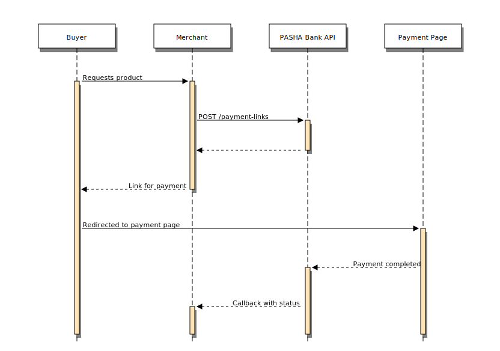
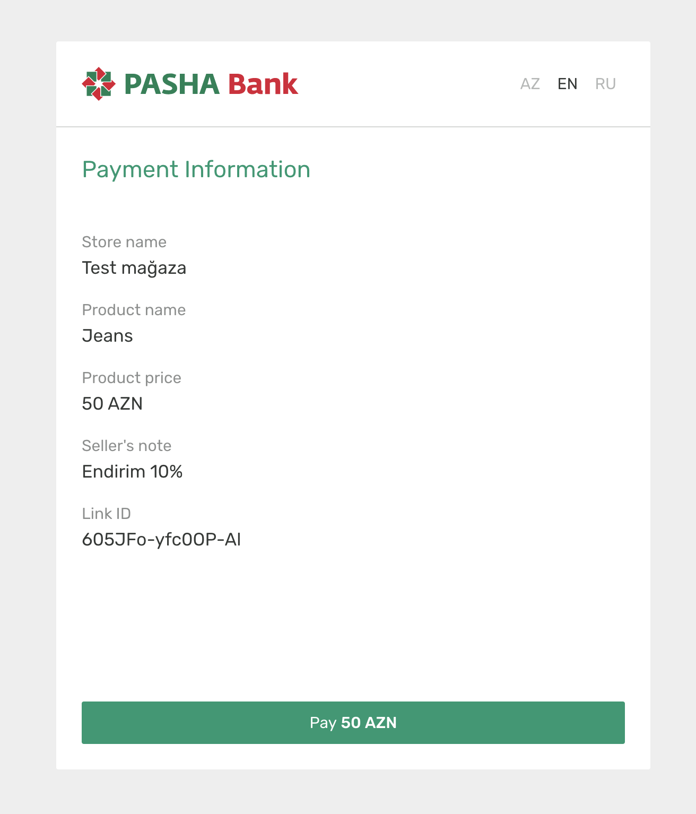

# Pay by Link API

With Pay by Link, you can accept payments using a payment link. The link takes your shopper to a secure, **PASHA Bank**-hosted payment page where they can pay using credit card.  
Payments made through Pay by Link are standard e-commerce payments. Pay by Link supports 3D Secure out of the box.

## How it works
When a shopper places an order, you create a payment link by providing payment information such as item name and amount. Next, you send the payment link to your shopper through email or chat. When the shopper selects the link, they see the payment page with payment details. After the shopper completes the payment, you receive the payment result through a callback URL (provided during connection to Pay by Link API).

Flow:   


Example of payment page:   


## Link expiry and reusability
By default, payment links expire after 48 hours. You will receive notification through callback URL. In this case Payment Page will show `404 Not Found` Illustration.  
By default, payment links can only be used to make one successful payment. After a shopper makes a successful payment, anyone accessing the same link will see a "Payment by this link was already made" message.   

Unfortunately you can not override this settings in version v1.0 of Pay by Link API.   


## API

### Connecting to Pay-by-Link Service
Connecting to PASHA Bank API can be done in 2 ways.
1. Through Online Bank. (Currently in development phase)
2. By contacting a representative of the PASHA Bank.  

### Overview of API
PASHA Bank uses API Key authorization mechanism to authorize each request.
API Key can be send as url param or through the header.

For development purposes API can be accessible through `https://openbankingdev.pashabank.digital` URL (currently blocked by VPN).

```bash
curl -X GET \
-H 'Content-Type: application/json' \
-H 'apikey: {{YOUR_API_KEY}}' \
'https://openbankingdev.pashabank.digital/v1/api/health'
```

Before using Pay-by-Link API you will need to provide the information below:
1. `Store name` - Name of the store or application that will you payment link functionality. It will be displayed to your customers.
2. `Merchant Account` - Bank Account where the funds will be transferred.  
3. `Callback URL` <Badge type="tip">optional</Badge> - URL where notification will be sent after payment success.

### Create Link

To create a payment link, make a POST request to `/payment-links` specifying the following:   

`productName`: Name of product or service you are selling.   
`price`: Product price in `float` format with 2 decimal points. Currently we only support `AZN` currency.   
`notes`: Description of the order. Can be visible to customer or can be private.   
`showNotes`: Indicates the `notes` visibility to your customer. `boolean`   

```json
POST /payment-links
Content-Type: application/json
apikey: "YOUR_API_KEY"

{
    "productName": "Test Item",
    "price": {
        "value": 20.50,
        "currency": "AZN"
    },
    "notes": "50% sale for you",
    "showNotes": true
}
```

You receive a response `201 OK` containing the following:    
`storeName`: name of your store / or application, provided during connection to Pay-by-Link Service.   
`status`: status of generated link. Possible values (`PAID`, `NOT_PAID`, `EXPIRED`)    
`expiresAt`: expiration time of link, by default +48 hours. Response provided with timezone    
`link`: The payment link that you should send to your customer.    

```json
{
    "id": 1,
    "storeName": "Test Merchant Name",
    "productName": "Test Item",
    "price": {
        "value": 20.50,
        "currency": "AZN"
    },
    "notes": "50% sale for you",
    "showNotes": true,
    "linkId": "xxxxx-xxxxxx-xx",
    "link": "https://payme.pashabank.digital/#/xxxxx-xxxxxx-xx",
    "expiresAt": "2020-09-02T18:05:58.601274+04:00",
    "status": "NOT_PAID",
    "createdAt": "2020-08-31T18:05:58.601274+04:00"
}
```

Possible HTTP codes:   
`201` - Created   
`500` - Internal Error   
`403` - Forbidden (Access denied)   

### Callback

After payment successfully completed or if link expired, you will receive POST request to callback URL provided during activation of Pay-by-Link Service. 
Sample POST Request provided below:

```bash
POST https://YOUR_CALLBACK_URL
Content-Type: application/json

{
  "linkId": "xxxxx-xxxxxx-xx",
  "status": "PAID"
}
```


### Link status

Additionally we provide URL to check link status manually. In case if callback URL not provided.

```bash
POST /payment-links/status
Content-Type: application/json
apikey: "YOUR_API_KEY"

{
    "linkId": "xxxxx-xxxxxx-xx"
}
```

Response body will be the same as in link creation request but http code will be `200 OK`.     
Possible HTTP codes:    
`200` - OK    
`404` - Provided link not found   
`500` - Internal Error occured   
`403` - Forbidden (Access revoked or denied)   

